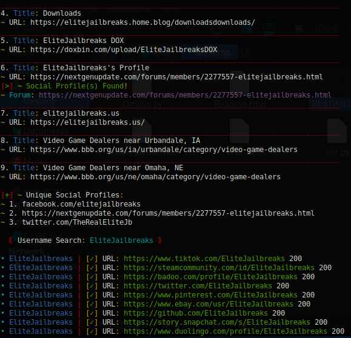

# Ominis OSINT - Information Gathering Tool

## Overview

Ominis OSINT is a powerful open-source information gathering tool designed for extracting valuable insights from search engine results, including mentions of a specific query and identification of associated social profiles. This tool utilizes web scraping techniques to analyze Google search results and provides a comprehensive report on relevant information.



## Features

- **Google Search Integration:** Ominis OSINT leverages Google Search to fetch results based on user queries, allowing for a broader exploration of online content.

- **Mention Analysis:** The tool identifies and extracts mentions of the user-specified query in both titles and URLs, providing a quick overview of the context in which the query appears.

- **Social Profile Detection:** Ominis OSINT employs predefined patterns to recognize social media profiles associated with the search results, giving users insights into potential social media presence related to the query.

- **Forum Detection:** The tool is equipped to identify potential forums in the URL, expanding the scope of information gathering for community-based discussions.

- **User-Agent Rotation:** To avoid detection and improve robustness, Ominis OSINT dynamically generates random user agents for HTTP requests.

- **Concurrent Execution:** With the inclusion of the `ThreadPoolExecutor`, the tool can efficiently execute multiple requests concurrently, enhancing performance.

## Requirements

- **Python:** Ominis OSINT is written in Python and requires Python 3.x to run.

- **Libraries:** The tool depends on external Python libraries such as `requests`, `BeautifulSoup`, `fake_useragent`, `colorama`, and `urllib3`. These can be installed using the provided `requirements.txt` file.

- **Google Search Limitations:** Due to the nature of web scraping, users may encounter Google Search rate limits. The tool implements retries to mitigate this issue.

## **Update 1.0 Releasing!**
- includes >
- Duckduckgo Engine Alternative incase of error too many requests from google
- Banner & Touchups
- Usage of SerpAPI (optional)

## Usage

1. Clone the repository:

   ```
   git clone https://github.com/AnonCatalyst/Ominis-Osint
   cd Ominis-Osint
   pip install -r requirements.txt
   python3 Ominis.py
   ```
