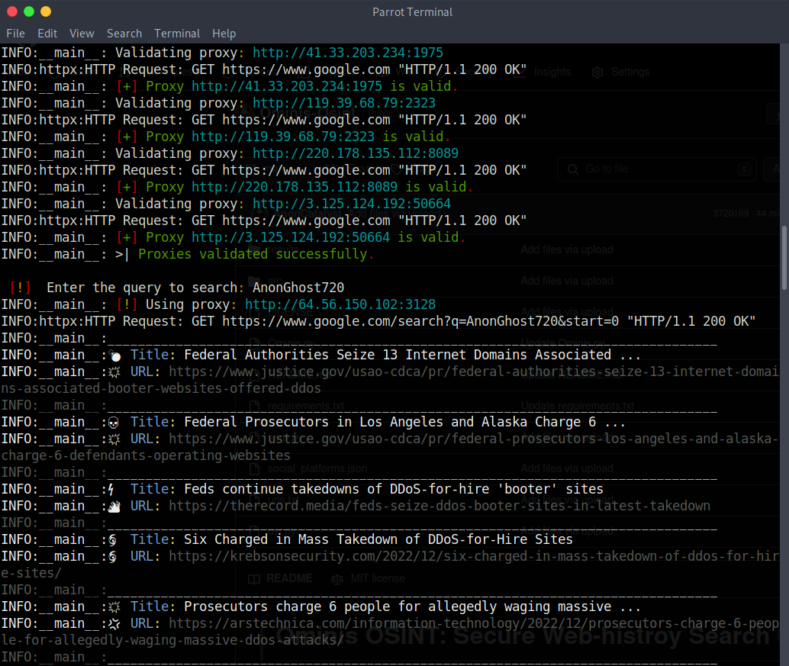

># Ominis-OSINT: Web Hunter 🌐🕵️‍♂️

**Information Obtained**
    Discover online mentions of a query or username.
    Identify potential social profiles and forums.


-- **NOTE:** `Hello World 🌍 👋 - Updated 5/11/2024 - Happy OSINTing!. 😉
`

-- **Support Server** `Help us grow our discord server or contact support by joining up with us today!` 
- https://discord.com/invite/rwjNemwere

## Compatibility and Future Releases

📱 **Mobile Compatibility:** Please note that Ominis OSINT is primarily designed for use on PC platforms and may not work on mobile environments such as Termux. However, a mobile release is being considered for future development to extend the toolkit's accessibility to mobile users. Stay tuned for updates!

**Contributing**
Contributions are welcome! Fork the repository, make changes, and submit a pull request.

> **License**
This project is licensed under the MIT License - see the LICENSE file for details.

🚀 Happy OSINTing! 🕵️‍♂️



## Features

    Goodle Search Filtering: 🖇 Take advantage of Google search by using the filtering features Country, Language, and date range.
    Enhanced User Interface: 🚀 Enjoy a redesigned interface for a seamless experience, suitable for both novice and experienced users.
    Expanded Digital Reconnaissance: 🔎 Conduct thorough investigations with advanced tools to gather and analyze publicly available information from diverse online sources.
    Threading Optimization: 💡 Experience faster execution times with optimized threading, improving efficiency and reducing waiting periods during username searches.
    Detailed Results: 📊 Gain comprehensive insights from search results, including detailed information extracted from various sources such as social profiles, mentions, and potential forum links.
    Proxy Validation: ⚙️ The tool validates proxies for secure and efficient web requests, ensuring anonymity and privacy during the search process. This feature enhances the reliability of the search results by utilizing a pool of validated proxies, mitigating the risk of IP blocking and ensuring seamless execution of the search queries.
    Human-like Behavior Mimicking: 🕵️‍♂️ To mimic human-like behavior and avoid detection by anti-bot mechanisms, the tool randomizes user agents for each request. This helps in making the requests appear more natural and reduces the likelihood of being flagged as automated activity.
    Randomized Proxy Agents: 🛡️ In addition to proxy validation, the tool utilizes randomized proxy agents for each request, further enhancing user anonymity. By rotating through a pool of proxies, the tool reduces the chances of being tracked or identified by websites, thus safeguarding user privacy throughout the reconnaissance process.
    Username Search: 🔍 Searches a list of URLs for a specific username. Utilizes threading for parallel execution. Provides detailed results with URL and HTTP status code.


These measures collectively contribute to ensuring user anonymity and privacy, providing a secure environment for conducting digital reconnaissance activities.

- **Username Search:**
  - Searches a list of URLs for a specific username.
  - Utilizes threading for parallel execution.
  - Provides detailed results with URL and HTTP status code.

🌐 Premier Digital Reconnaissance Solution

Ominis OSINT Secure Web-Hunter stands as a premier solution for digital reconnaissance, offering unparalleled capabilities in gathering, analyzing, and interpreting publicly available information sourced from diverse online platforms. With its comprehensive suite of features, Ominis equips users to navigate through the expansive digital landscape with precision and efficiency, enabling the extraction of valuable insights from a myriad of sources.

🔍 Comprehensive Data Gathering

From scouring social media platforms and forums to parsing through web pages and search engine results, Ominis OSINT leaves no stone unturned in the quest for relevant data. Its robust functionality encompasses advanced techniques for data collection, including scraping proxies, asynchronous HTTP requests, and intelligent pattern matching. This ensures that users can access a wealth of information while adhering to the highest standards of data integrity and security.

📊 Sophisticated Analysis Capabilities

Moreover, Ominis OSINT goes beyond mere data retrieval, providing sophisticated analysis tools to uncover hidden connections, identify emerging trends, and discern actionable intelligence from vast troves of digital content. Whether it's investigating potential threats, conducting due diligence, or gathering competitive intelligence, Ominis empowers users with the insights they need to make informed decisions and stay ahead in an increasingly complex digital landscape.

🛠️ Cutting-edge Technology

In essence, Ominis OSINT redefines digital reconnaissance, offering a comprehensive solution that combines cutting-edge technology with intuitive functionality. By harnessing the power of publicly available data, Ominis enables users to unlock new opportunities, mitigate risks, and navigate the digital realm with confidence and precision.

Updated Features in usr.py:

    Concurrent Execution: 🚀 The script now utilizes thread pools for concurrent execution, enhancing efficiency in searching across multiple URLs simultaneously.

    Detailed Output: 📝 Provides detailed output including titles, meta descriptions, and snippets of HTML content for each URL searched, facilitating better understanding and analysis.

    Logging: 📋 Logs errors and exceptions encountered during execution to a log file (username_search.log), enabling easy troubleshooting and debugging.

    Enhanced Error Handling: ⚠️ Provides informative error messages and logs unexpected errors encountered during execution, improving script reliability and maintainability.

    Query Detection: 🔍 Detect the query in HTML content, description and titles.

## Targetable and Actionable Results 🎯

Ominis OSINT provides a wealth of targetable and actionable results, empowering users with valuable insights and intelligence from the digital landscape. Here are some key areas where Ominis excels:

### 1. Identifying Potential Threats 🚨

   - Monitoring online chatter to identify security breaches, cyberattacks, or malicious activities.
   - Proactively mitigating risks and safeguarding assets.

### 2. Monitoring Competitors 🕵️‍♂️

   - Tracking competitors' online presence, social media activities, and product launches.
   - Identifying market trends, assessing competitor strategies, and capitalizing on opportunities.

### 3. Gathering Human Intelligence 👥

   - Collecting human intelligence from forums, social media, and online discussions.
   - Staying informed about emerging trends, sentiment analysis, and public opinion.

### 4. Detecting Brand Mentions 📣

   - Tracking brand mentions, reviews, and sentiment across social media and news articles.
   - Analyzing customer feedback, addressing concerns, and managing online reputation.

### 5. Investigating Individuals 🔍

   - Conducting background checks, investigating individuals, and gathering public information.
   - Identifying relationships, affiliations, employment history, and online activities.

### 6. Uncovering Financial Insights 💰

   - Monitoring business news, financial reports, and regulatory filings.
   - Assessing financial health, identifying investment opportunities, and detecting fraud.

### 7. Mapping Digital Footprints 🗺️

   - Aggregating data to create comprehensive profiles of individuals, organizations, or events.
   - Tracking geolocation, online activities, social connections, and historical data.

### 8. Tracking Online Campaigns 📊

   - Monitoring online campaigns, social media trends, and digital marketing efforts.
   - Analyzing engagement metrics, identifying influencers, and optimizing marketing strategies.

### 9. Monitoring Regulatory Compliance 📝

   - Tracking industry regulations, legal developments, and enforcement actions.
   - Staying informed about compliance requirements and implementing proactive measures.

### 10. Forecasting Emerging Risks 📈

   - Leveraging predictive analytics to forecast emerging risks and market shifts.
   - Anticipating vulnerabilities, seizing opportunities, and staying ahead of the curve.

### 11. Google Search Filtering 🖇
   - Adjust your search by using the filtering features (Language, Country, and Date-range).

Ominis OSINT Tools delivers actionable insights that enable users to make informed decisions, mitigate risks, and capitalize on opportunities in a rapidly evolving digital landscape.


## Configuration

- Web search uses Google by default.
- Configure the list of URLs in `src/urls.txt` for username searches.

## Installation
   ```
   git clone https://github.com/AnonCatalyst/Ominis-OSINT
   pip install -r requirements.txt
   ```
- Run the following command at your own risk if your having installation issues when using pip 
``` 
pip install -r requirements.txt --break-system-packages
```
    
> **Usage**

1. Navigate to the script's directory:
   - `cd Ominis-OSINT`
3. Run the desired script:
   - `python3 ominis.py`

